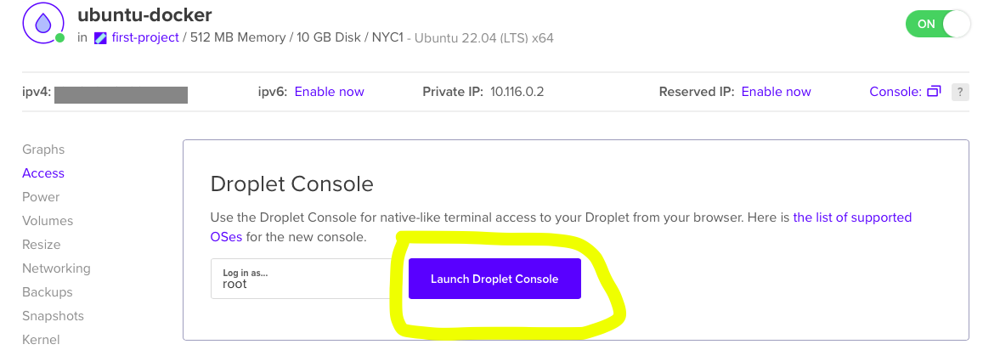
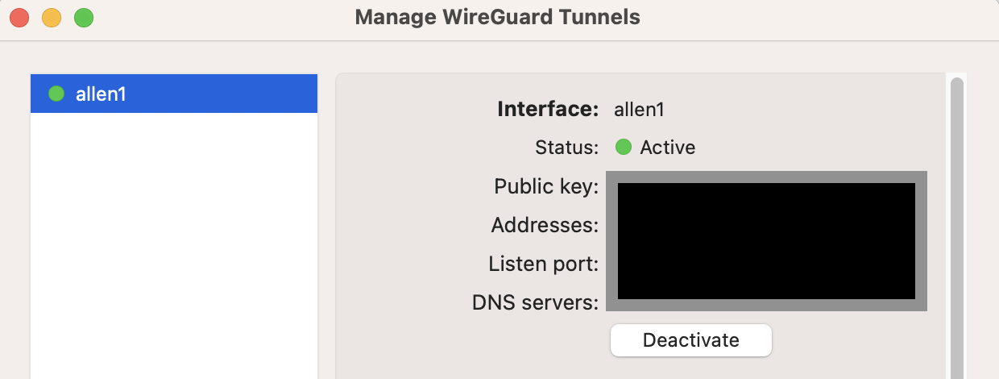

##  Installation Guide: Cloud Wireguard VPN Using Docker On Ubuntu 22.04


<n></n>

In this installation guide, we will be using several tools including Digital Ocean, Docker, and Wireguard to install a running VPN. Before we get started, here are some basic knowledge about the tools:

<b>Digital Ocean</b> is a cloud service provider that provides a simple and easy to use infrastructure for deploying applications. Some servies they provided include virtual machine, storage, and many other cloud services.

<b>Docker</b> is a platform that allows developers to build, deliver, and run applications in containers. By using a Docker platform, you will be able to package your applications and dependencies into containers. In addition, the changes that you made within the docker and containers will not affect your underlying infrastructure.

<b>Wireguard</b> is a lightweight and secured Virtual Private Network (VPN) that allows users to create point-to-point encrypted connections between different divices over the internet. Because Wireguard is designed with a smaller code base, it makes the overall routine maintenance and auditing much more manageable.


### Step #1 Getting Started On Digital Ocean

In order to deploy our applications, we will need a cloud service provider with a simple and easy-to-use infrastructure for us to use. In this guide, we will be using Digital Ocean, but you may use your own cloud service provider if you prefer. 

#### Step #1.1 Create an account on Digital Ocean
  - Visit [Digital Ocean Site](https://m.do.co/c/4d7f4ff9cfe4 ) and create an account, you will be eligible for a $200 credit if you register with the link provided.

#### Step #1.2 Create a droplet for Ubuntu server

   -  Log in to your Digital Ocean
   -  Click on the "Create" button and then select "Droplets"
   -  Select the region that closest to your location
   -  Select the OS system and version: Ubuntu Version 22.04 (LTS) x64
   -  For other settings, you can choose whatever applicable to you. However, this tutorial is using the following: 
      - Droplet Type: Basic
      - CPU options: Premium Intel; 1 GB/1CPU; 25 GB SSD; 1000 GB tansfer
      - Password Authentication
      - Name your server, so you easily identify which one is which
    - Once everything is configured, click on "Create Droplet" to create your server

You should have this screen when you successfully created your droplet:


#### Step #1.3 Connect to your Ubuntu server

Once you successfully created your droplet, then you can connect to your Ubuntu server via tools like "Terminal" on MacBook or you can directly connect to your server by directly using the Digital Ocean Access Console:



#### Step #1.4 Setting up your Ubuntu server

-  Create a new non-root admin user
   ```
   adduser user_name
   usermod -aG sudo user_name
   su user_name
   ```
- Once your are under the non-root user, then you can start updateing your server before other steps by using the following command:
   ```
   sudo apt update && sudo apt upgrade
    ```


### Step 2.1 Install Docker on your Ubuntu server

- Optional: Remove previous Docker files
  ```
  sudo apt remove docker docker-engin docker.io
  ```
- Install Docker with following command (select y when prompted):
  ```
  sudo apt install docker.io
  ```
- Install dependency packages for docker:
  ```
  sudo apt install apt-transport-https ca-certificates curl software-properties-common
  ```
- Add the GPG Key for Docker
  ```
  curl -fsSL https://download.docker.com/linux/ubuntu/gpg | sudo gpg --dearmor -o /usr/share/keyrings/docker-archive-keyring.gpg
  ```
- Add Docker repository to apt folder sources.
  ```
  echo "deb [arch=$(dpkg --print-architecture) signed-by=/usr/share/keyrings/docker-archive-keyring.gpg] https://download.docker.com/linux/ubuntu $(lsb_release -cs) stable" | sudo tee /etc/apt/sources.list.d/docker.list > /dev/null
  ```
- Update packages and install Docker
  ```
  sudo apt update
  sudo apt-cache policy docker-ce
  sudo apt install docker-ce -y
  ```
- Test if set up correct, check docker status and then pull an image from Docker Hub:
  ```
  sudo systemctl status docker
  ```
  - You should see an output with the status of your Docker
 
  ```
  sudo docker run hello-world
  ```
  - You should see something like this:
  ```
  Hello from Docker! 
  This message shows that your installation appears to 
  be working correctly.
    ```
    
- Since Docker requests may executed by root user by default, you should also add your user to docker, so they have the permission to operate
  ```
  sudo usermod -aG docker username
  ```
  
  
#### 2.2 Install Docker Compose
- Once Docker is properly installed, then it's time to install Docker-Compose
  ```
  sudo curl -L "https://github.com/docker/compose/releases/download/1.27.4/docker-compose-$(uname -s)-$(uname -m)" -o /usr/local/bin/docker-compose
  ```
- Modify the permissions for the downloaded file
  ```
  sudo chmod +x /user/local/bin/docker-compose
  ```
- Test and check the installation by verifying the version of your compose
  ```
  docker-compose --version
  ```


### Step #3 Setup Wireguard on your server

- Run following commands to set up a directory for your Wireguard
  ```
  mkdir -p ~/wireguard/
  cd /home/wireguard/
  ```
- Get the file docker-compose.yml from github
  ```
  wget https://raw.githubusercontent.com/WeeJeWel/wg-easy/master/docker-compose.yml
  ```
- Configure the Wireguard
  ```
  sudo nano docker-compose.yml
  ```
- Modify these sections accordingly:
  1. ```WG_HOST``` This section is for your host address, you should put your digital ocean ipv4 address here if you follow along with this guide.
  2. ```PASSWORD``` This section is to set up the password for your Wireguard UI, so you can login to your Wireguard UI and customize your VPN server later.

- Once completed editing, Hit ```CTRL```+```X```, then ```Y``` and ```ENTER```

- (Optional) By default, the connection is blocked on public WIFI such as port 80, you may allow this type of connection by forwarding your Ubuntu port 80 to your Docker port 51820
  - In your docker-compose.yml file, add port 80:80
  ```    
     ports:
      - "51820:51820/udp"
      - "51821:51821/tcp"
      - "80:80"
  ```
  - Set up port forwarding on your Ubuntu server to send port 80 communication to 51820 in the Docker Container.

  ```
  sudo iptables -t nat -A PREROUTING -p tcp --dport 80 -j DNAT --to-destination 172.17.0.2:51820
  ```
  *Please note that you should lookup your own docker ip address to replace the 172.170.0.2 shown here.
  - To lookup your own docker ip address, please run the following command:
    ```
    sudo docker inspect container-name | grep IPAddress
    ```
    And you should see something like this:
    ```
                "SecondaryIPAddresses": null,
            "IPAddress": "",
                    "IPAddress": "172.18.0.2",  ```

<n></n>


#### Step 2.3 Start up Wireguard

After completing all the configuration, now it's time to start the Wireguard service.
```
Docker-compose up --detach
```


### Step #4 Connecting to your Wireguard VPN

- Connect to your Wireguard UI
  <n></n>Open your browser and go to: ``` Your_Ubuntu_IPv4_Address:51821 ```
  - If you used a password to set up earlier, you may have to enter your password.
  - 
 

- From here, you can either use your mobile client to scan the QR code to connect your VPN or download the conf file under ```~/wireguard/config/``` and then use your Wireguard client to connect.


### And... Here you go! Your VPN is now active and running

