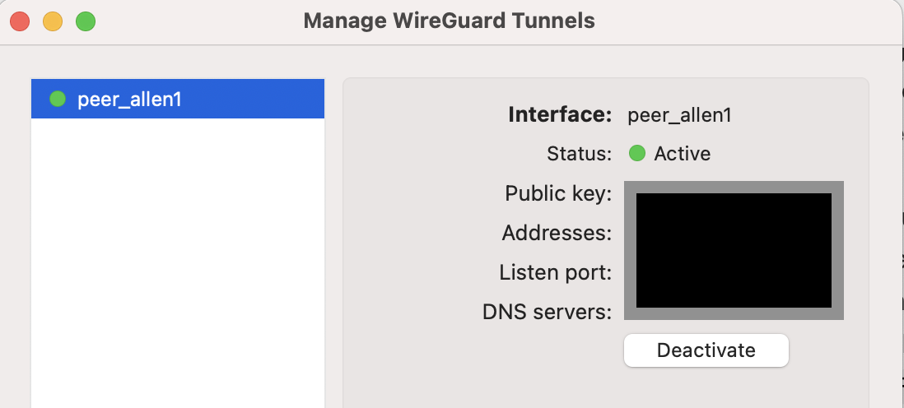

##  Installation Guide: Cloud Wireguard VPN Using Docker


<n></n>

In this installation guide, we will be using several tools including Digital Ocean, Docker, and Wireguard to install a running VPN. Before we get started, here are some basic knowledge about the tools:

<b>Digital Ocean</b> is a cloud service provider that provides a simple and easy to use infrastructure for deploying applications. Some servies they provided include virtual machine, storage, and many other cloud services.

<b>Docker</b> is a platform that allows developers to build, deliver, and run applications in containers. By using a Docker platform, you will be able to package your applications and dependencies into containers. In addition, the changes that you made within the docker and containers will not affect your underlying infrastructure.

<b>Wireguard</b> is a lightweight and secured Virtual Private Network (VPN) that allows users to create point-to-point encrypted connections between different divices over the internet. Because Wireguard is designed with a smaller code base, it makes the overall routine maintenance and auditing much more manageable.


### Step #1 Getting Started On Digital Ocean

In order to deploy our applications, we will need a cloud service provider with a simple and easy-to-use infrastructure for us to use. In this guide, we will be using Digital Ocean, but you may use your own cloud service provider if you prefer. 

#### Step #1.1 Create an account on Digital Ocean
  - Visit [Digital Ocean Site](https://m.do.co/c/4d7f4ff9cfe4 ) and create an account, you will be eligible for a $200 credit if you register with the link provided.

#### Step #1.2 Create a droplet for Ubuntu server

   -  Log in to your Digital Ocean
   -  Click on the "Create" button and then select "Droplets"
   -  Select the region that closest to your location
   -  Select the OS system and version: Ubuntu Version 22.04 (LTS) x64
   -  For other settings, you can choose whatever applicable to you. However, this tutorial is using the following: 
      - Droplet Type: Basic
      - CPU options: Premium Intel; 1 GB/1CPU; 25 GB SSD; 1000 GB tansfer
      - Password Authentication
      - Name your server, so you easily identify which one is which
    - Once everything is configured, click on "Create Droplet" to create your server

You should have this screen when you successfully created your droplet:


#### Step #1.3 Connect to your Ubuntu server

Once you successfully created your droplet, then you can connect to your Ubuntu server via tools like "Terminal" on MacBook or you can directly connect to your server by directly using the Digital Ocean Access Console:


#### Step #1.4 Setting up your Ubuntu server

-  Create a new non-root admin user
   ```
   adduser user_name
   usermod -aG sudo user_name
   su user_name
   ```
- Once your are under the non-root user, then you can start updateing your server before other steps by using the following command:
   ```
   sudo apt update && sudo apt upgrade
    ```


### Step 2 Install Docker on your Ubuntu server

- Optional: Remove previous Docker files
  ```
  sudo apt remove docker docker-engin docker.io
  ```
- Install Docker with following command (select y when prompted):
  ```
  sudo apt install docker.io
  ```
- Install dependency packages for docker:
  ```
  sudo snap install docker
  ```
- Test if set up correct, pull an image from Docker Hub:
  ```
  sudo docker run hello-world
  ```
  - You should see something like this:
  ```
  Hello from Docker! 
  This message shows that your installation appears to 
  be working correctly.
    ```
- Install Docker-Compose
  ```
  sudo curl -L "https://github.com/docker/compose/releases/download/1.27.4/docker-compose-$(uname -s)-$(uname -m)" -o /usr/local/bin/docker-compose
  ```

### Step #3 Setup Wireguard on your server

- Run following commands to set up Wireguard's necessary files and directories:
  ```
  mkdir -p ~/wireguard/config/
  nano ~/wireguard/docker-compose.yml
  ```
- Copy and paste the following content to your docker-compose.yml
  ```
  version: '3.8'
  services:
  wireguard:
    container_name: wireguard
    image: linuxserver/wireguard
    environment:
      - PUID=1000
      - PGID=1000
      - TZ=Asia/Hong_Kong
      - SERVERURL=1.2.3.4
      - SERVERPORT=51820
      - PEERS=pc1,pc2,phone1
      - PEERDNS=auto
      - INTERNAL_SUBNET=10.0.0.0
    ports:
      - 51820:51820/udp
    volumes:
      - type: bind
        source: ./config/
        target: /config/
      - type: bind
        source: /lib/modules
        target: /lib/modules
    restart: always
    cap_add:
      - NET_ADMIN
      - SYS_MODULE
    sysctls:
      - net.ipv4.conf.all.src_valid_mark=1
  ```

- Modify these sections accordingly:
  1. ```TZ``` means timezone, you need to change this according to your location. For this guide, we will use Pacific/Honolulu
  2. ```SERVERURL``` means your Ubuntu server public ip address. You will need to retrieve from your Digital Ocean Droplet dashboard and paste it here.
  3. ```PEERS``` means the users who will be using the Wireguard. This will create the user-config-files.

- Once completed editing, Hit ```CTRL```+```X```, then ```Y``` and ```ENTER```


<n></n>

- Start Wireguard:
  ```
  cd ~/wireguard/
  sudo docker-compose up -d
  ```
  You should see something like this:
  ```
  Status: Downloaded newer image for linuxserver/wireguard:latest
  Creating wireguard ... done
    ```


### Step #4 Connecting to your Wireguard VPN

- Generate conf file for users to connect
  ```
  docker-compose logs -f wireguard
  ```
  You should see the output of QR codes for your users

- From here, you can either use your mobile client to scan the QR code to connect your VPN or download the conf file under ```~/wireguard/config/``` and then use your Wireguard client to connect.


### And... Here you go! Your VPN is now active and running
